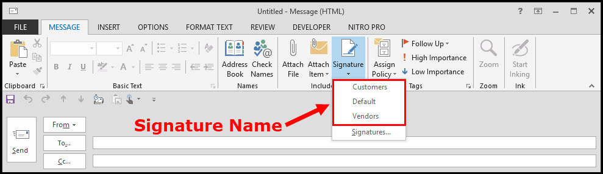

# MS Outlook Module for Visual Basic for Application

- **Developed by:** [Julio L. Muller](https://www.jjsolutions.net/)
- **Released on:** May 12, 2018
- **Updated on:** Jan 30, 2019
- **Latest version:** 1.0.0
- **License:** *FREE*

## Installation

Imprort the `*.bas` file into your Visual Basic project by following the steps:

1. With the Excel workbook open. start the VBE window (`Alt + F11`);
2. In the menu, click on *File* > *Import File...* (`Ctrl + M`);
3. Through the file explorer, select the **OutlookModule.bas** file;
4. An item called *OutlookModule* will show up on your *Modules* list;
5. Enjoy!

Alternatively, copy and paste the plain text from the `*.txt` file into an existing module in your project.

## Content Summary

| Type         | Name                                            | Return Type |
|:------------:|:------------------------------------------------|:-----------:|
| **Enum**     | EmailTextFormat                                 | -           |
| **Sub**      | [SetOutlookConnection](#set-outlook-connection) | -           |
| **Function** | [GetOutlookSignature](#get-email-signature)     | *String*    |
| **Function** | [SendEmail](#send-email)                        | *Boolean*   |
| **Function** | [ConvertRangeToHTML](#convert-range-to-html)    | *String*    |

## Resources Documentation

This module has direct interactions with MS Office Outlook application, then it is highly recommended to use this functions while running Outlook, so any errors are less likely to occur.

It is important to mention that a few resources may encounter limitations depending on your local corporate guidelines. Some organizations do not allow other applications to run scripts over Outlook for security reasons, therefore, the known issues related to these eventual limitations will be pointed in the specific use of the library.

### Set Outlook Connection

With `SetOutlookConnection()`, you can toggle Outlook connection *on* or *off*. This is useful whenever you need to ensure that any email submitted keep parked in the Outbox for review before it is sent effectively.

#### Structure

```vbnet
Sub SetOutlookConnection(isOnline As Boolean)
```

- **isOnline** - Provide *True* to connect Outlook to the network or *False* to make it work offline.

#### Example

```vbnet
'Turn Outlook to work offline, so generate batch of emails to park in the Outbox

    Dim contacts As Range, c As Range
    Dim subject As String
    Dim message As String
    Set contacts = Sheets("Customers").Range("Table1[Email]")
    subject = "Greetings"
    message = "Hello, customer!"

    Call SetOutlookConnection(False)

    For Each c In contacts
        If (c.Value <> "") Then
            Call SendEmail(True, subject, message, PLAIN_TEXT, Array(c.Value))
        End If
    Next c
```

### Get Email Signature

Function `GetOutlookSignature()` accesses the local folder and retrieves user signature. To use this function, the user must have created asignature in MS Outlook. When it is done, Outlook generates 3 files in your **~\AppData\Roaming** directory, refering to the three text formats supported by Outlook, with the exact same name of the one set in Outlook.

#### Structure

```vbnet
Function GetOutlookSignature(signatureName As String) As String
```

- **signatureName** Name of the signature set in Outlook. If an invalid name is provided, the function will return an empty string.
- ***return*** - Text of the signature formatted as HTML.



#### Example

```vbnet
'Turn Outlook to work offline, so generate batch of emails to park in the Outbox

    Dim subject As String
    Dim message As String
    Set contacts = Sheets("Customers").Range("Table1[Email]")
    subject = "Proposal"
    message = "Dear Customer, <br>" & _
        "<br>" & _
        "Please, find the proposal attached. <br>" & _
        GetOutlookSignature("Customer")

    If SendEmail(True, subject, message, HTML, Array(Range("G12").Value), attachments:=Array(Range("G15").Value)) Then
        MsgBox "Email sent successfully.", vbInformation"
    Else
        MsgBox "Failed to send message.", vbInformation"
    End If
```

### Send Email

`SendEmail()` finally submit content to MS Outlook for sending. It returns a boolean value with the success or failure in running the script.

#### Structure

```vbnet
Function SendEmail( _
    sendAfterwards As Boolean, _
    subject As String, _
    emailBody As String, _
    msgFormat As EmailTextFormat, _
    Optional toContacts As Variant, _
    Optional ccContacts As Variant, _
    Optional bccContacts As Variant, _
    Optional attachments As Variant, _
    Optional otherSenderAddress As String _
) As Boolean
```

- **sendAfterwards** - Receives a boolean value. This resource is commonly *True*, but you can set it to *False* thether you want the email to be displayed and reviewed before being manually sent.
- **subject** - String to be set as subject of the message.
- **emailBody** - String to be set as message.
- **msgFormat** - Encoding format which the message will be send. This parameter receives the enumeration declared in the library with the 3 otions supported by Outlook:
  - `HTML` - The most common format for message, accepting text formating through CSS and HTML tags.
  - `PLAIN_TEXT` - Only text allowed. No formating.
  - `RICH_TEXT` - Similar to HTML, but only supported by Outlook.
- **toContacts** (optional) - Array with the email addresses that will be set in the *To* field of the email.
- **ccContacts** (optional) - Array with the email addresses that will be set in the *CC* field of the email.
- **bccContacts** (optional) - Array with the email addresses that will be set in the *BCC* field of the email.
- **attachments** (optional) - Array with the file paths to be attached to the email.
- **otherSenderAddress** (optional) - If you do not want the application to generate and send emails from your default email address, you can pass here a string with the *From* address you want the message to be sent from.
- ***return*** - The function returns a boolean value. Thus, you can evaluate its result in an *If* statement and treat errors.

#### Example

```vbnet
'Loops through list of customer contacts and send email.

    Dim contacts As Range, c As Range
    Dim subject As String
    Dim message As String
    subject = "Greetings"
    message = "Hello, customer!"

    For Each c In contacts
        If (c.Value <> "") Then
            Call SendEmail(True, subject, message, PLAIN_TEXT, Array(c.Value))
        End If            '                                    ^
    Next c

'NOTE: Although you have only a single receipt address to send the message, 
'      it is required to convert the parameters to *array* (use `Arrau()` function)
```

### Convert Range to HTML

You can convert a range of cells in your spreadsheet to HTML equivalent text. With `ConvertRangeToHTML()`, you can insert it entirely or as part if your email message, without losing the formating you set in your worksheet. It is very useful if you have a template email message saved as HTML and have tokenn words to be replaced ny key ones (see usage in *Example* section).

#### Structure

```vbnet
Function ConvertRangeToHTML(rngTarget As Range) As String
```

- **rngTarget** - Receives an object *Range* which points to your target cells to be converted to HTML.
- ***return*** - Returns the wquivalent HTML string. Save it to a variable to manipulate the content or use it in the *SendEmail()* function.

#### Example

```vbnet
'Copy the spreadsheet content set in cells A4 through H32 and insert it in an email body

    Dim content As Range
    Dim subject As String
    Dim message As String

    Set content = Range("A4:H32")
    subject = "Proposal"
    message = ConvertRangeToHTML(content)

    Call SendEmail(True, subject, message, HTML, Array(Range("C3).Value))
```

## Compatibility

The scripts were tested **ONLY** in MS Excel & Outlook 2013 and 2016. MS Access and other MS Office applications were not tested.

Please, report any issues (or even success on running it in other Office applications or versions) through the commentary session.

## Other Contents

- [File Handler Module for VBA](https://github.com/juliolmuller/VBA-Module-TextFile)
